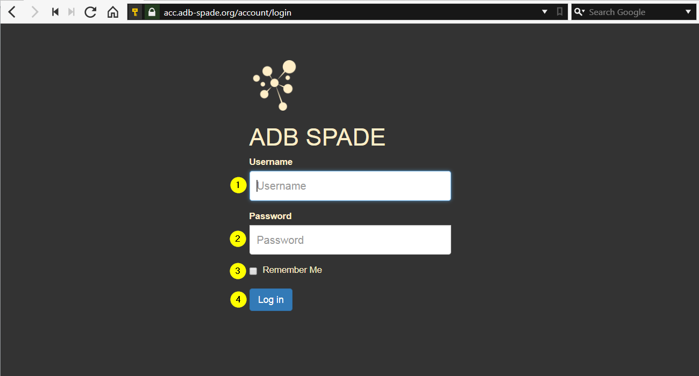

.. _logging_in:

============================
Logging In
============================

When opening SPADE in a web browser, a user first needs to login:

*	A user can log in, by filling in the username [1] & password [2] followed by pressing the “Log in” button [4].
*	There’s an option to remember the login session [3].
 
.. toctree::
    :hidden:
