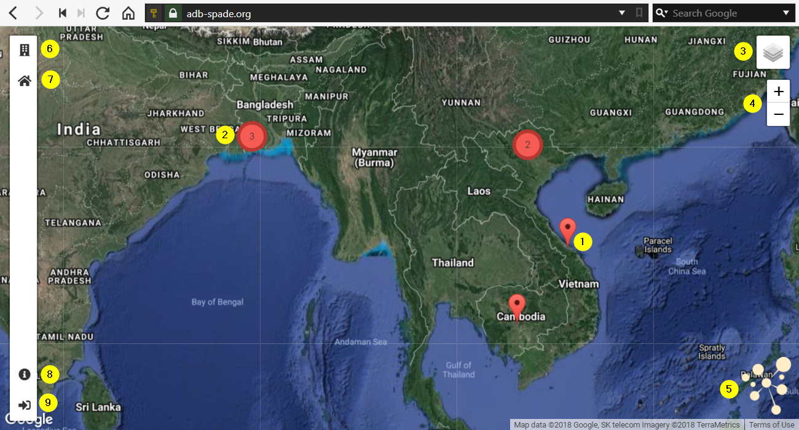

.. _spade_landing_page:

============================
SPADE Landing Page
============================

After logging in, the SPADE landing page opens. Using this page, a user can navigate to maps for the city of interest.

1.	Clicking on the marker of a city, opens the SPADE map viewer with the featured map for a city. This featured map is to be curated by a SPADE administrator.
2.	When cities are located close to each other, a cluster is shown, indicating the number of clustered cities. Clicking on a cluster marker makes to map zoom in to the cities that form the cluster:
    .. figure:: img/clusters.png
3.	Moving the mouse over the layer-switcher opens a list of layers. It is possible to change the background and to toggle the visibility of the city markers:
    .. figure:: img/background_switcher.png
4.	The plus/minus buttons can be used to zoom the map in and out.
5.	Clicking the SPADE logo will reload the SPADE landing page.
6.	The button the top of the sidebar will open the SPADE city search. This tool can be used to search a city by name. Clicking on the name of a city will open its featured map (same as clicking the marker on the map). The search bar can be used to find a city in the list of cities.
    .. figure:: img/city_search.png
7.	The 2nd button from the top of the sidebar, is the home button. Clicking the home button will move the map back to its original extent.
8.	The 2nd button from the bottom of the sidebar, is the info button. Clicking this button, makes the pop-up active. Clicking on a city now no longer directly opens a map, but opens a pop-up with all maps and layers relevant for this city (see :ref:`spade_city_pop_up`).
9.	The bottom button in the sidebar is the admin button. Clicking this button opens the SPADE data administration interface. This section of SPADE is only relevant for data administrators.

.. toctree::
    :hidden:

    001_city_popup/index
