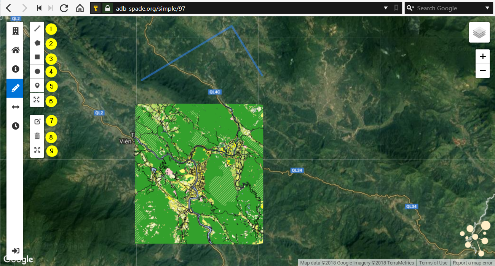

.. _spade_drawing_toolbar:

============================
Drawing Toolbar
============================

The SPADE drawing toolbar, provides several drawing tools that can be used to draw (redlining) and measure on the map:

1.	**Polyline**: draws a line on the map:
  *	Final segments are shown using a solid blue line.
  *	The current, provisional segment is shown using a dashed blue line.
  *	Distance along the line is shown during the drawing process.
  *	A line can be finished by either doubleclicking the location of the final point, or using the “Finish” button.
  *	The “Delete last point” button can be used to delete the last point. Using this button, user can undo all the points until the last correct point.
  *	Cancel button cancels the drawing process.
  *	After finishing a line, clicking on the line opens a pop-up showing the length of the line.

  .. figure:: img/draw_polyline.png
  .. figure:: img/draw_polyline_detail.png

2.	**Polygon**: draws a polygon on the map:
  * Final segments are shown using a solid line.
  * The current, provisional segment is shown using a dashed line.
  * Distance along the line and estimaed area is shown during the drawing process.
  * A polygon can be finished either by closing it (clicking on the starting point again) or using the “Finish” button.
  * The “Delete last point” button can be used to delete the last point. Using this button, user can undo all the points until the last correct point.
  * Cancel button cancels the drawing process.
  * After finishing a polygon, clicking on the polygon opens a pop-up showing the area of the polygon.
3.	**Rectangle**: draws a rectangle on the map:
  * Rectangle can be drawn by dragging the mouse from one corner to the opposite corner.
  * Cancel button cancels the drawing process.
  * Area of the result is shown during the drawing process.
  * After finishing a rectangle, clicking on the rectangle opens a pop-up showing the area of the rectangle.
4.	**Circle**: draws a circle on the map:
  * Circle can be drawn by dragging the mouse from the center outwards.
  * Cancel button cancels the drawing process.
  * Radius of the result is shown during the drawing process.
  * After finishing a circle, clicking on the circle opens a pop-up showing the coordinates of the centre and the radius of the circle.
5.	**Marker**: draws a marker on the map:
  * Marker can be drawn by clicking on the map.
  * Cancel button cancels the drawing process.
  * After finishing a marker, clicking on the marker opens a pop-up showing the coordinates of the marker.
6.	**Circle marker**: draws a circle marker on the map:
  * Circle marker can be drawn by clicking on the map.
  * Cancel button cancels the drawing process.
7.	**Edit**: opens edit mode:
  * Vertices of drawn objects are shown as squares on the map. These squares can be dragged around to edit the drawn objects.
  * Save buttons saves the changes and closes edit mode.
  * Cancel button cancels the changes and closes edit mode.
8.	**Delete**: opens delete mode:
  * Clicking on an object deletes this object.
  * Save buttons saves the changes and closes delete mode.
  * Cancel button cancels deletions and closes delete mode.
  * Clear all button deletes all drawn objects at once.
9.	**Expand**: opens buffer mode:
  * Clicking on an object followed by dragging the mouses, creates a buffer around this object (possible for circle, rectangle, polygon and polyline).
  * Buffer distance is shown during the drawing process.
  * After finishing a buffer, clicking on the resulting objects opens a pop-up showing its area.
  * Save buttons saves the changes and closes buffer mode.
  * Cancel button cancels deletions and closes buffer mode.

.. toctree::
    :hidden:
