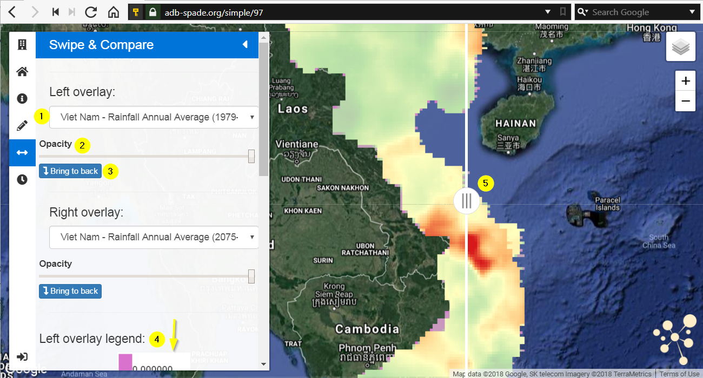

.. _swipe_and_compare:

============================
SPADE Swipe & Compare
============================

The SPADE Swipe & Compare tool is designed to help comparing two different situations. This can for instance be land cover at different moments in time, expected flood depth for different return periods or climate scenarios.

1.	Using the dropdown, a layer for the left overlay can be selected. This layer is shown on the area of the map located to the left of the swiper bar [5]. There is a similar dropdown for the right overlay.
2.	Using this slider, the opacity of the left layer can be modified. This makes it possible to “see through” the layer and see other layers lying behind. There is a similar slider for the right overlay.
3.	Using this button, the position of the left layer can be switched between the front (no other layers on top) and the back (in front of the basemap, but behind all other layers). There is a similar button for the right overlay.
4.	The legend for both left- and right overlays is shown in the sidebar.
5.	The swiper bar forms the demarcation between the left and the right overlay. By moving this bar sideways, differences between the two layers can be analysed.
 

.. toctree::
    :hidden:
