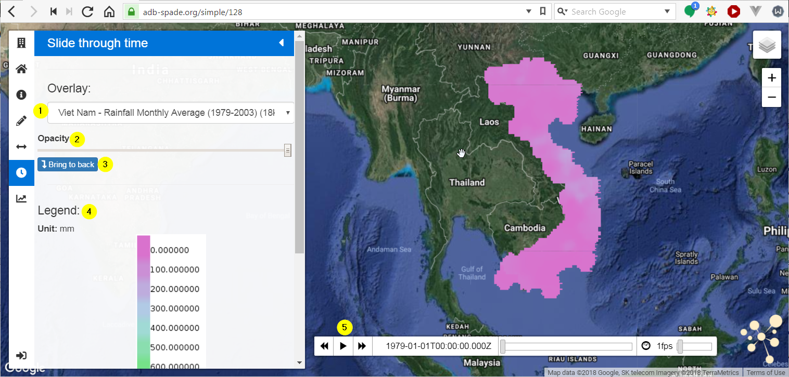

.. _slide_through_time:

============================
SPADE Slide Through Time
============================

The SPADE Slide through time tool is designed to visualize developments in time. This can for instance be monthly precipitation during a year.

1.	Using the dropdown, a layer for the time enabled overlay can be selected.
2.	Using this slider, the opacity of the time-enabled layer can be modified. This makes it possible to “see through” the layer and see other layers lying behind
3.	Using this button, the position of the time-enabled layer can be switched between the front (no other layers on top) and the back (in front of the basemap, but behind all other layers).
4.	The legend for the time-enabled layer is located in the sidebar.
5.	The control bar can be used to control the time-enabled layer. The control bar contains the following functions:
  * Backward – moves one timestep backwards.
  * Play – starts animated playback
  * Forward – moves one timestep ahead.
  * Time – Shows the time of the current timestep. Can be used to switch between UTC time and local time.
  * Location – Shows the position of the current timestep along the whole interval. Can be used to select a certain timestep.
  * Speed slider – can be used to modify the speed of the animated playback.

.. toctree::
    :hidden:
