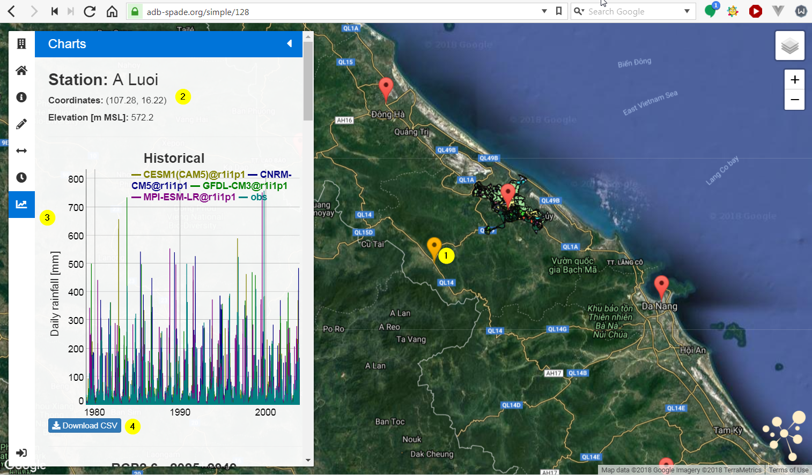

.. _charts:

============================
SPADE Charts
============================

The SPADE Charts tool is designed to make timeserie data available to users. When opening the tool, the stations that are configured for the map are shown on a map using a marker. When stations are located close to each other, a cluster is shown, indicating the number of clustered stations. Clicking on a cluster marker makes to map zoom in to the stations that form the cluster.

1.	Clicking on the marker of a station, opens chart panel in the sidebar, also the marker of the selected station changes its color to orange.
2.	Basic information of the station is shown in the upper area of the chart panel.
3.	All timeseries are shown in charts in the side-panel. A legend is shown above the chart. It is possible to zoom in on a specific period by selecting a section of the chart (click on the chart and select the desired area while keeping the button pressed). Zoom can be reset by doing a double-click.
4.	The underlying data can be downloaded in CSV-format.

.. toctree::
    :hidden:
