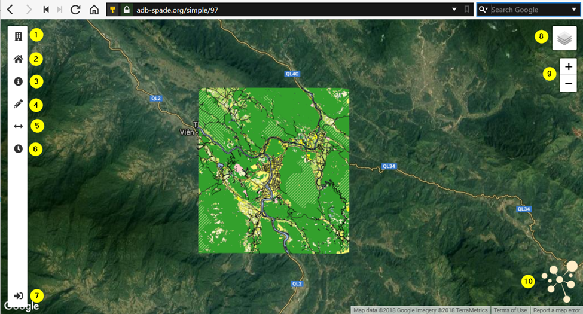

.. _spade_map_viewer_detail:

============================
SPADE Map viewer
============================

The SPADE map viewer looks similar to the SPADE landing page. Biggest differences are some extra tools in the sidebar and more layers in the map (and the layer switcher).

1.	The button the top of the sidebar will open the SPADE city search. This tool can be used to search a city by name. Clicking on the name of a city will open its featured map (same as clicking the marker on the map). The search bar can be used to find a city in the list of cities.
  .. figure:: img/city_search.png
2.	The 2nd button from the top of the sidebar, is the home button. Clicking the home button will move the map back to its original extent.
3.	The 3rd button from the top of the sidebar, is the info button. Clicking this button, makes the pop-up active. Clicking the map now opens a pop-up with the attributes of the object at the location of the click event. If more layers are present, pop-up is shown for the uppermost layer. A pop-up can be closed by clicking the closing button in the upper right corner.
  .. figure:: img/pop-up.png
4.	This button opens the :ref:`spade_drawing_toolbar`
5.	This button opens the :ref:`swipe_and_compare`
6.	This button opens the :ref:`slide_through_time`
7.	The bottom button in the sidebar is the admin button. Clicking this button opens the SPADE data administration interface. This section of SPADE is only relevant for data administrators.
8.	Layer Switcher
9.	The plus/minus buttons can be used to zoom the map in and out.
10.	Clicking the SPADE logo will open the SPADE landing page.

.. toctree::
    :hidden:

    001_drawing_toolbar/index
    002_swipe_and_compare/index
    003_slide_through_time/index
    004_spade_charts/index
