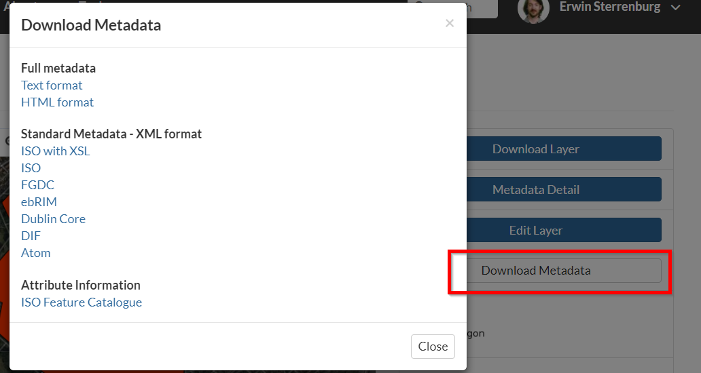

.. _layers.info:

Layer information
=================

After upload, another form will displaying, containing metadata about the layer. Change any information as desired, and then click :guilabel:`Update` at the very bottom of the form.

   *Layer metadata*

.. todo:: Do we care about setting any of this?

After the update, the layer will display in a preview window.

   *Layer preview*

This page contains lots of options for managing this layer. Let's look at a few of them:

Downloads
---------

.. todo:: No option to edit data. Why not?

At the top of the page there are two buttons titled :guilabel:`Download Layer` and :guilabel:`Download Metadata`. These buttons provide access to the ability to extract geospatial data and metadata from within GeoNode. In this way, GeoNode allows for two way data and metadata access; one can import as well as export data.

Export Data – Download layer
^^^^^^^^^^^^^^^^^^^^^^^^^^^^

#. Click the :guilabel:`Download Layer` button. You will see a list of options of the supported export formats.

   *Available export formats*

#. Click the option for :guilabel:`Zipped Shapefile`.

#. GeoNode will process the request and bring up a Save As dialog. Save this file to your computer, and note how it is the same content as was uploaded.

Export Data – Clip and Ship
^^^^^^^^^^^^^^^^^^^^^^^^^^^
SPADE provides functionality to download a portion of large raster files for use in a desktop GIS system. When opening the Clip tool, a list of configured rasters available for clipping are shown:

The detail page for a clip-able layer shows a map. In this map, a section can be drawn for which the data will be downloaded (in georeferenced tiff-format).

1.	Zoom buttons
2.	Drawing buttons: function the same as in the SPADE Drawing Toolbar (:ref:`spade_drawing_toolbar`)
3.	Download button: starts the download for the drawn location
4.	Drawn location for which the data will be downloaded.

Export Metadata
^^^^^^^^^^^^^^^

#. Click the :guilabel:`Download Metadata` button. You will see a list of options of the supported export formats.

   *Available metadata export formats*

#. Click the option for :guilabel:`DUBLIN CORE`.

#. GeoNode will process the request and display XML metadata.  Try clicking various metadata formats, and note how it is the same metadata content in various formats compatible with metadata and GIS packages.

Layer Detail Tabs
-----------------

#. Scroll down the page toward the bottom. Five tabs are available: :guilabel:`Info`, :guilabel:`Attributes`, :guilabel:`Share`, :guilabel:`Ratings`, and :guilabel:`Comments`. The info tab is already highlighted, and presents basic information about the layer, of the kind that was seen on the layer list page.

   .. figure:: img/infotab.png

      *Layer Info tab*

#. Click the :guilabel:`Attributes` tab. This lists the attributes of the layer, including statistics (range, average, median and standard deviation).  Layer attribute statistics are made available only for numeric attributes.  As we can see, this layer's attributes are not numeric, so no statistics are calculated.

   .. figure:: img/layerattributes.png

      *Attributes tab*

#. Click the :guilabel:`Ratings` tab. This tab allows you (and others viewing this page) to rate this layer. Ratings can be based on quality, accuracy, or any other metric. Click on the appropriate star to rate this layer.

   .. figure:: img/layerrating.png

      *Layer Ratings tab*

#. Click the :guilabel:`Comments` tab. This tab allows you to leave a comment for other viewing this layer.

   .. figure:: img/layercomment.png

      *Layer Comments tab*

#. Click the :guilabel:`Add Comment` button and enter a comment.

   .. figure:: img/commentadd.png

      *Adding a new comment*

#.  When finished, click :guilabel:`Submit Comments`

   .. figure:: img/commentadded.png

      *New comment posted*
