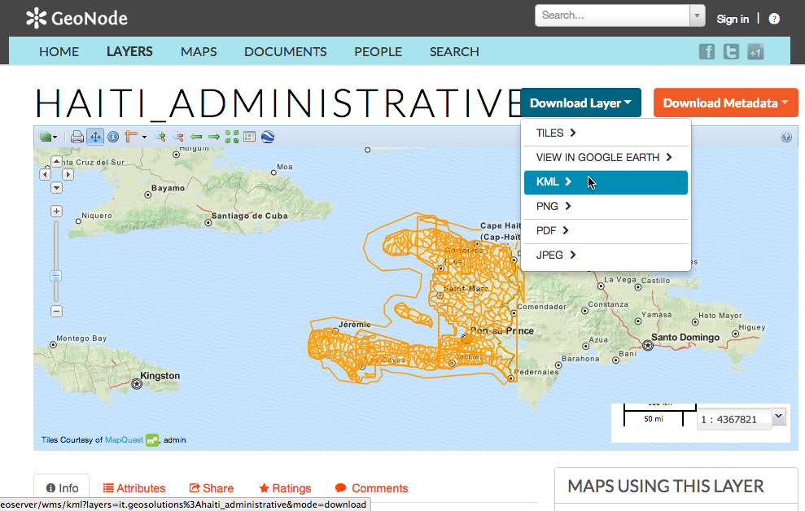
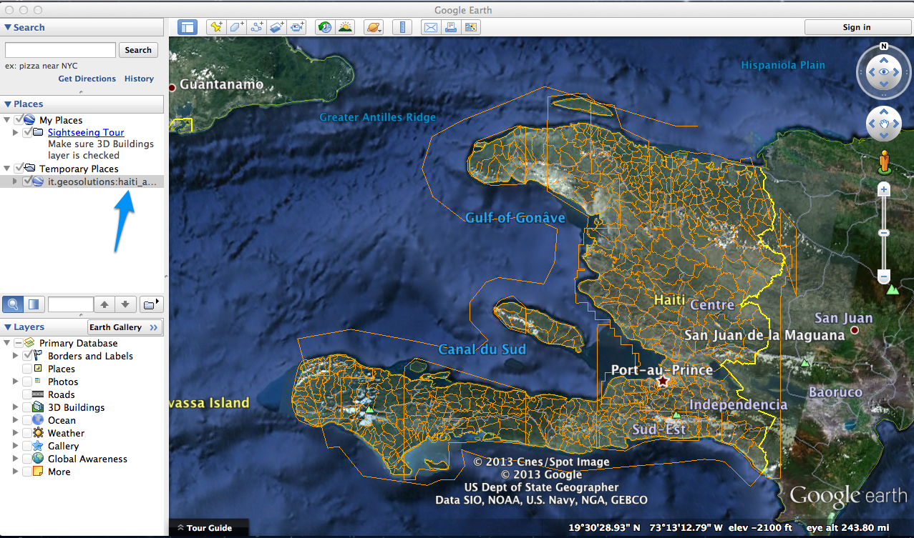
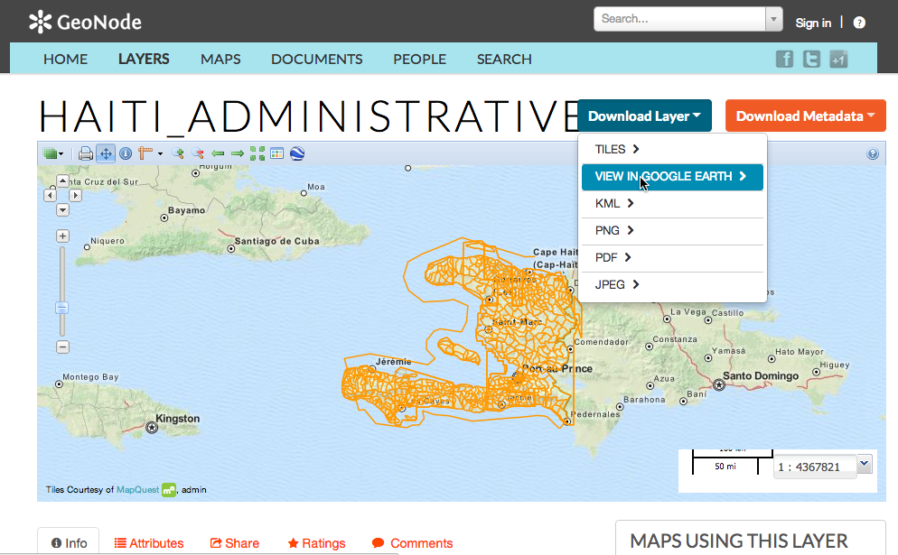
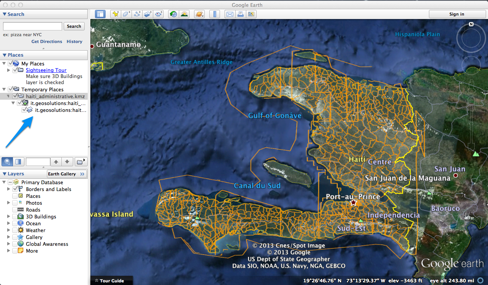

.. _google_earth:

Google Earth
============

If instead you want to use layers from your GeoNode in the Google Earth client itself, you have a few options available to you.

First, you can select the KML option from the Download Layer menu to download the entire layer in a single KML file. Depending on the size of the layer, your GeoNode could take several seconds or longer to generate this KML and return it to you.

When the layer is generated, it will be downloaded to your desktop machine and you can simply double click it to open it in Google Earth.

Alternatively, you can use the "View in Google Earth" option in the Layer Download menu to view the layer in Google Earth using the same methodology described above depending on the zoom level.

This will download a small KMZ to your desktop that contains a reference to the layers on the server and you can double click it to open it in Google Earth.

.. note:: The basic difference between these two options is that the first downloads *all* of the data to your desktop at once and as such, the downloaded file can be used offline while the second is simply a Network Link to the layer on the server. Choose whichever method is best for your own needs and purposes.

Once you have added your layers to the Places panel in Google Earth, you can move them from the Temporary Places section into My Places if you wish to use them after your current Google Earth session is complete. You can arrange them in folders and use Google Earth functionality to save your project to disk. Consult Google Earths documentation for more information about how to do this.
