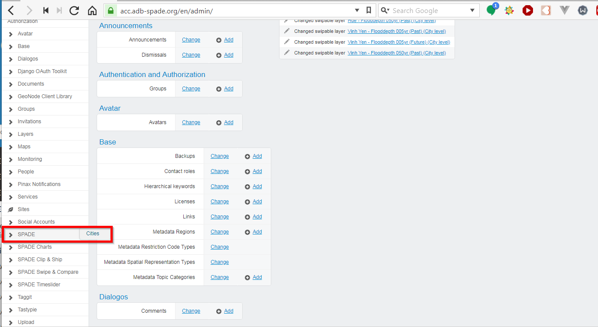
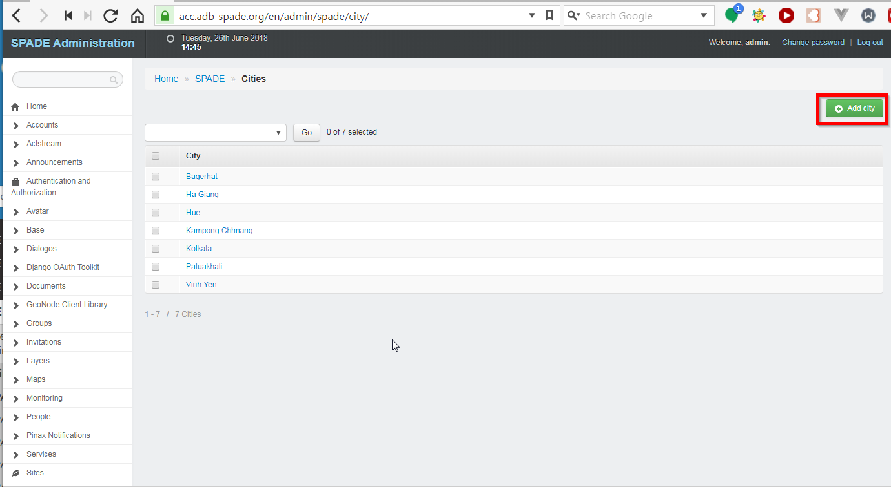
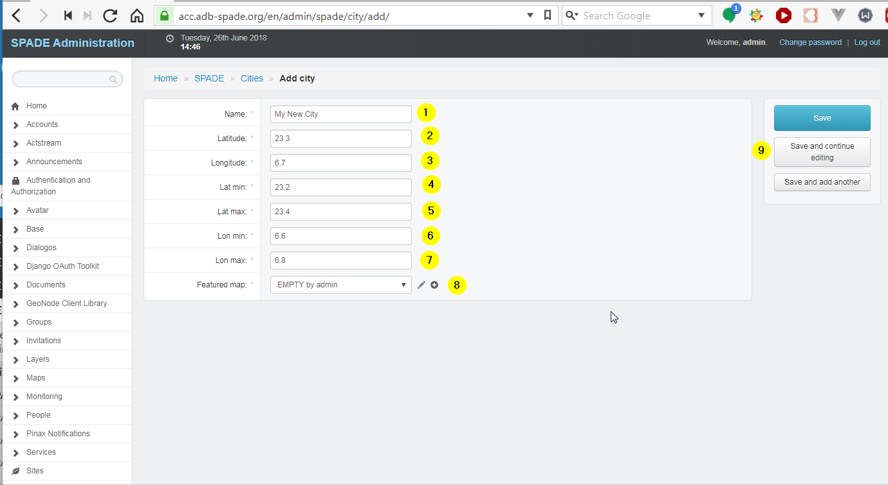
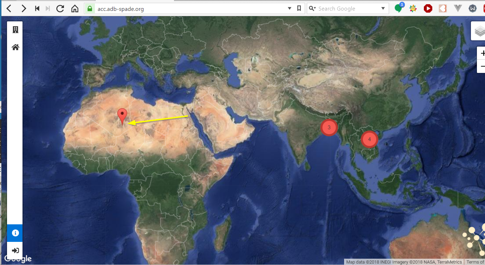
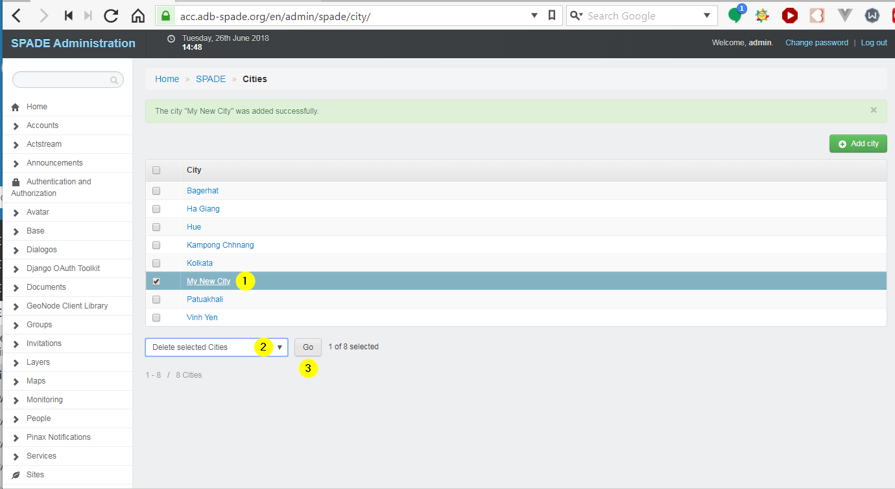

.. cities:

==================================================
SPADE Cities
==================================================
The SPADE cities are managed using the Django Adminstration panel [#f1]_.

Add a new city
--------------

In the menu on the left, choose *SPADE*, followed by *cities*.

Press the *Add City* button.

A form opens in which the attributes of the new city can be entered.

  1. Name of the new city.
  2. Latitude of the new city.
  3. Longitude of the new city.
  4. Minimal Latitude of bounding box of the area around the city we are interested in.
  5. Maximal Longitude of bounding box of the area around the city we are interested in.
  6. Minimal Latitude of bounding box of the area around the city we are interested in.
  7. Maximal Longitude of bounding box of the area around the city we are interested in.
  8. Featured map for the city (i.e. the map that will be opened when a user clicks on the city in the :ref:`spade_landing_page`).
  9. Save buttons.

When a new city is added, it is directly shown on the :ref:`spade_landing_page`

Modify a city
-------------
In the menu on the left, choose *SPADE*, followed by *cities* (same as above). Clicking on the name of the city opens the attribute form in which the city can be modified.

Delete a city
-------------
In the menu on the left, choose *SPADE*, followed by *cities* (same as above). Now a city can be deleted as follows:

  1. Selecting them in the list
  2. Choosing the action *Delete selected cities* in the dropdown
  3. Pressing the Go button.

.. rubric:: Footnotes

.. [#f1] see :ref:`admin_panel`
