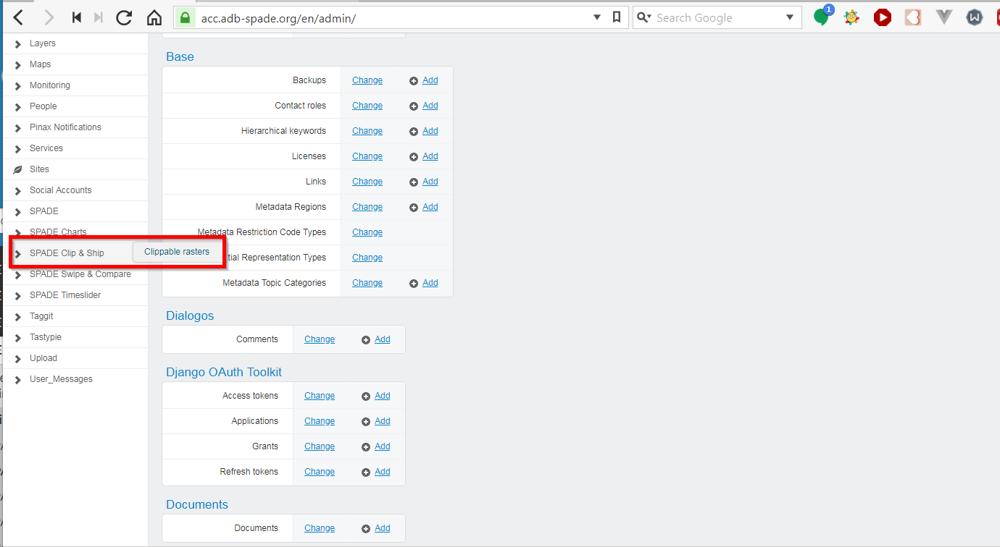
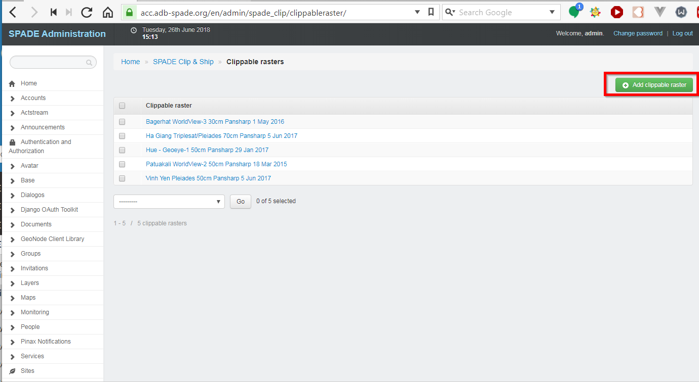
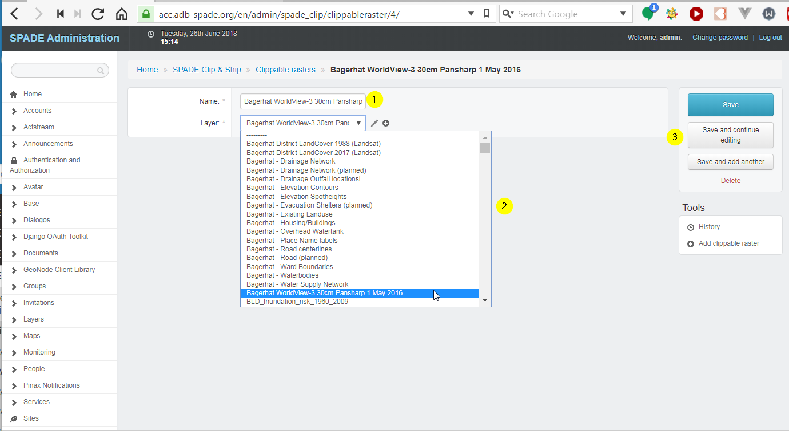
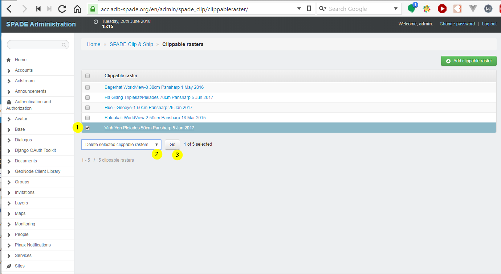

.. _clippable_layers:

==================================================
SPADE Clippable Raster
==================================================

The rasters that are available for the Clip & Ship tool are managed using the Django Adminstration panel [#f1]_.

Clippable rasters are created based on a standard GeoNode raster layer, so make sure the raster you want to make available for clipping are already present in SPADE.

Add a new Clippable Raster
--------------------------

In the menu on the left, choose *SPADE Clip & Ship*, followed by *Clippable rasters*.

Press the *Add clippable raster* button.

A form opens in which the attributes of the new clippable raster can be entered.

  1. Name of the clippable raster.
  2. Standard GeoNode layer to be used.
  3. Save buttons.

Modify a  Clippable Raster
--------------------------
In the menu on the left, choose *SPADE Clip & Ship*, followed by *Clippable rasters* (same as above). Clicking on the name of the clippable raster opens the attribute form in which the clippable raster can be modified.

Delete a Clippable Raster
--------------------------
In the menu on the left, choose *SPADE Clip & Ship*, followed by *Clippable rasters* (same as above). Now a clippable raster can be deleted as follows:

  1. Selecting them in the list
  2. Choosing the action *Delete selected clippable rasters* in the dropdown
  3. Pressing the Go button.

.. rubric:: Footnotes

.. [#f1] see :ref:`admin_panel`
