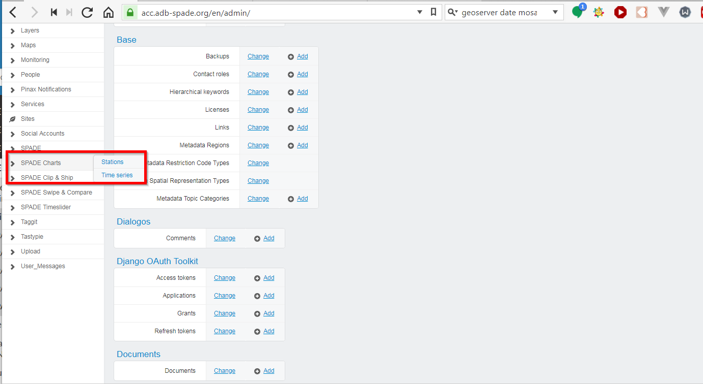
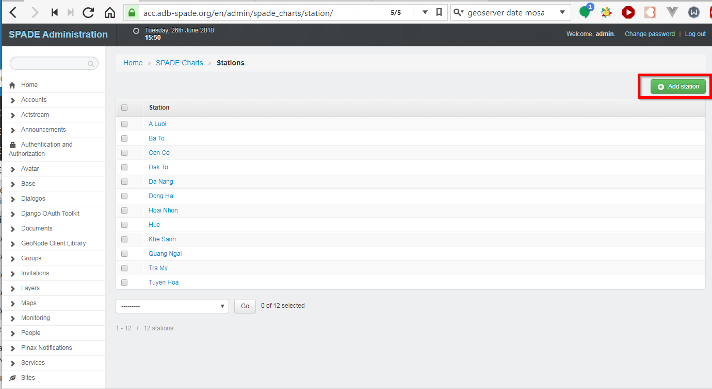
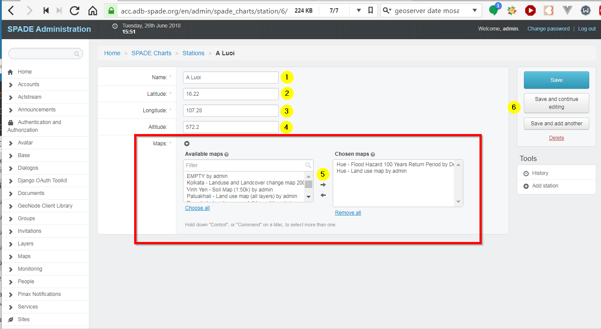
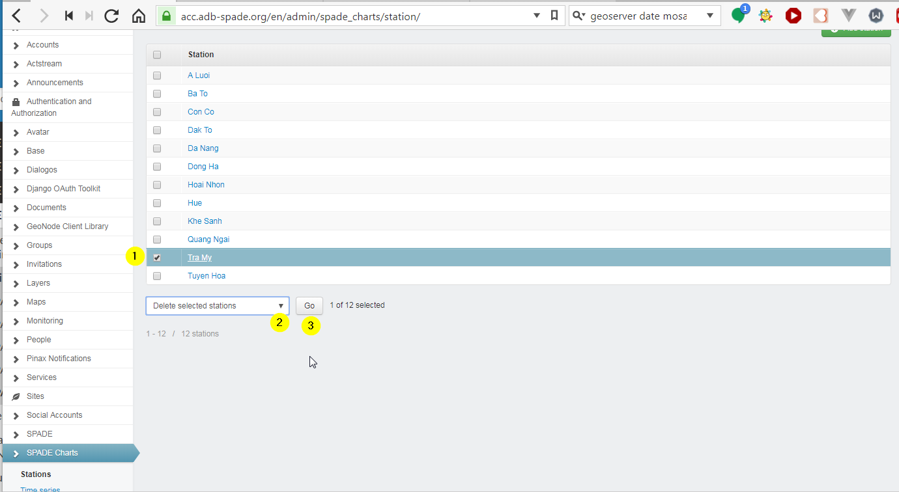
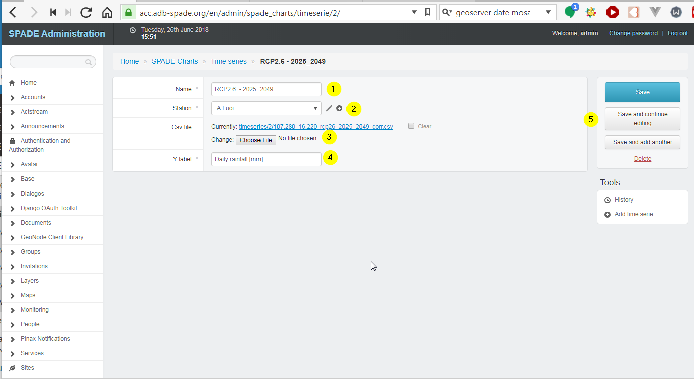

.. _stations:

==================================================
SPADE Charts
==================================================

SPADE Charts uses two types of objects: stations (physical locations at which measurements are done) and timeseries (sets of measured values in time for a station). The SPADE stations and timeseries are managed using the Django Adminstration panel [#f1]_.

Add a new station
-----------------

In the menu on the left, choose *SPADE Charts*, followed by *stations*.

Press the *Add Station* button.

A form opens in which the attributes of the new station can be entered.

  1. Name of the new station.
  2. Latitude of the new station.
  3. Longitude of the new station.
  4. Altitude of the new station.
  5. Maps in which the stations will be made available in the :ref:`charts` tool (multiselect).
  6. Save buttons.

Modify a station
--------------------------
In the menu on the left, choose *SPADE Charts*, followed by *stations* (same as above). Clicking on the name of the station opens the attribute form in which the station can be modified.

Delete a station
--------------------------
In the menu on the left, choose *SPADE Charts*, followed by *stations* (same as above). Now a station can be deleted as follows:

  1. Selecting them in the list
  2. Choosing the action *Delete selected stations* in the dropdown
  3. Pressing the Go button.

Managing timeseries
--------------------------
Timeseries are added, modified and deleted in the same way as stations. When a timeserie is added, the station at which the timeserie has been measured can be selected.

  1. Name for the timeserie (title in the chart).
  2. Station at which the values have been measured.
  3. CSV-file with the measured Data.
  4. Y-label: label that will be shown at the Y-axis in the chart.
  5. save buttons.

.. rubric:: Footnotes

.. [#f1] see :ref:`admin_panel`
