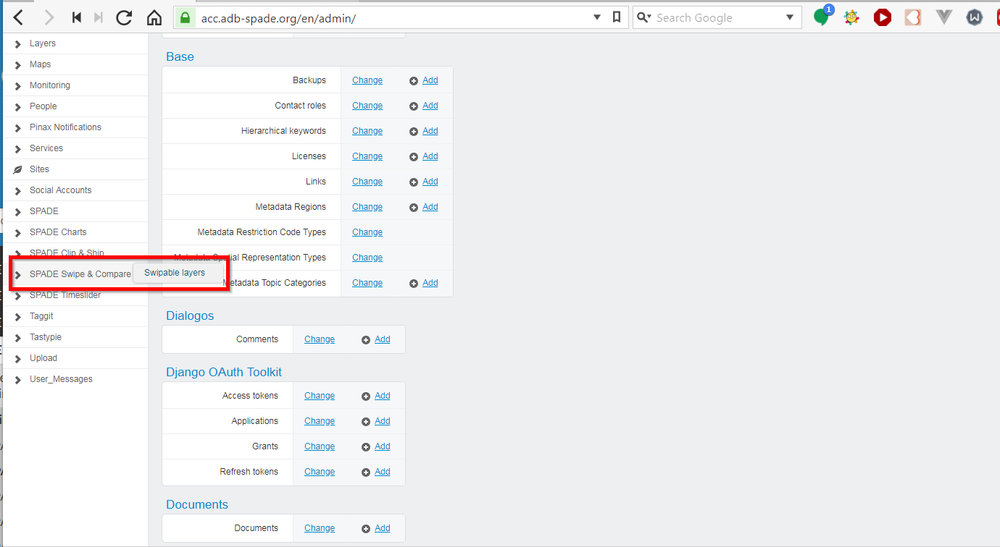
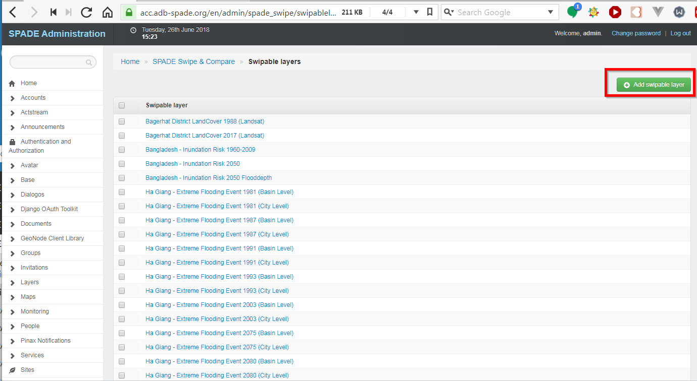
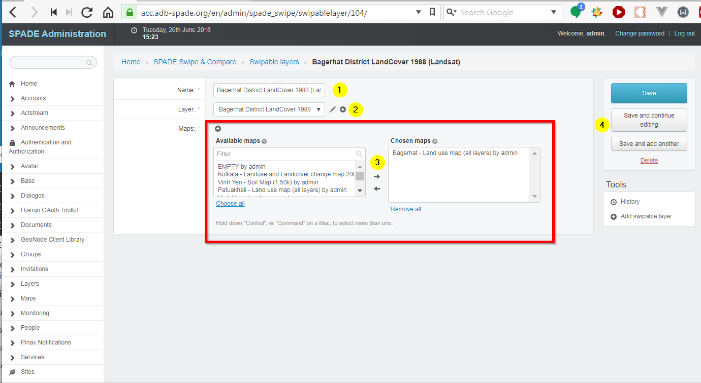
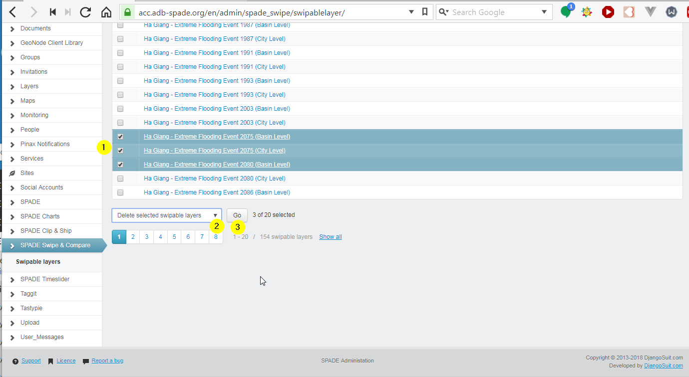

.. _swipable_layers:

==================================================
SPADE Swipable Layers
==================================================

The layers that are available for the :ref:`swipe_and_compare` tool are managed using the Django Adminstration panel [#f1]_.

Swipable Layers are created based on a standard GeoNode layer, so make sure the layers you want to make available for swiping are already present in SPADE.

Add a new Swipable Layer
--------------------------

In the menu on the left, choose *SPADE Swipe & Compare*, followed by *Swipeable layers*.

Press the *Add swipable layer* button.

A form opens in which the attributes of the new swipeable layer can be entered.

  1. Name of the swipable layer.
  2. Standard GeoNode layer to be used.
  3. Maps in which the layer will be made available in the :ref:`swipe_and_compare` tool (multiselect).
  4. Save buttons.

Modify a Swipable Layer
--------------------------
In the menu on the left, choose *SPADE Swipe & Compare*, followed by *Swipeable layers* (same as above). Clicking on the name of the swipable layer opens the attribute form in which the swipeable layer can be modified.

Delete a Swipable Layer
--------------------------
In the menu on the left, choose *SPADE Swipe & Compare*, followed by *Swipeable layers* (same as above). Now a swipable layer can be deleted as follows:

  1. Selecting them in the list
  2. Choosing the action *Delete selected swipable layers* in the dropdown
  3. Pressing the Go button.

.. rubric:: Footnotes

.. [#f1] see :ref:`admin_panel`
