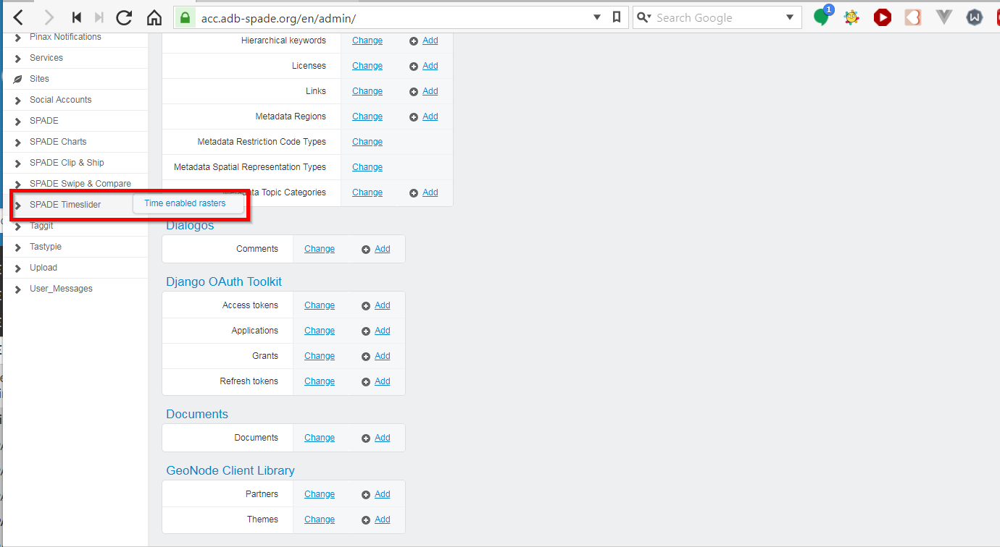
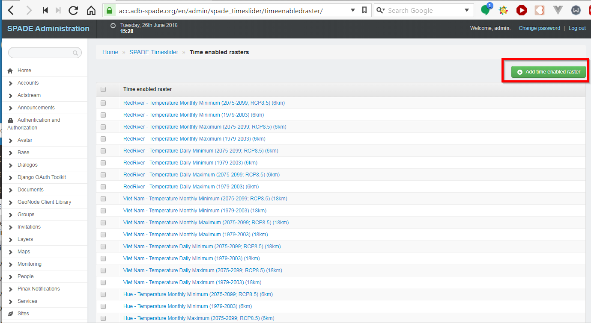
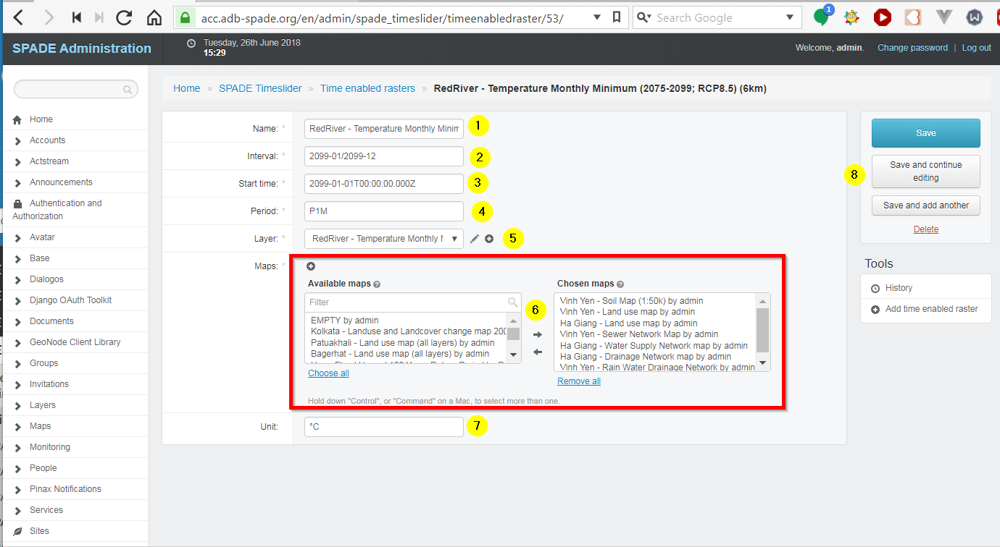
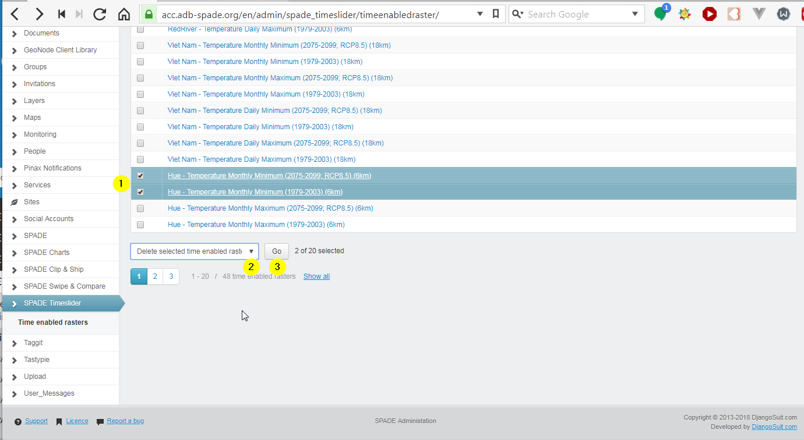

.. _time_enabled_rasters:

==================================================
SPADE Time-enabled Rasters
==================================================

The layers that are available for the :ref:`slide_through_time` tool are managed using the Django Adminstration panel [#f1]_.

Time-enabled rasters are created based on a standard GeoNode layer, so make sure the layers you want to make available for time animations are already present in SPADE.

Preparing GeoNode Layers suitable for time-enabled rasters
------------------------------------------------------------

  1. Prepare an image mosaic layer in GeoServer (http://docs.geoserver.org/latest/en/user/tutorials/imagemosaic_timeseries/imagemosaic_timeseries.html)
  2. Update the layers in GeoNode, based on the layers in Geoserver using the Updatelayers management command (:ref:`admin_mgmt_commands`).
  3. Create the time-enabled raster in SPADE as described below.

Add a new Time-enabled Raster
------------------------------

In the menu on the left, choose *SPADE Timeslider*, followed by *Time enabled rasters*.

Press the *Add time enabled raster* button.

A form opens in which the attributes of the new time-enabled raster can be entered.

  1. Name of the time-enabled raster.
  2. Interval.
  3. Start time.
  4. Period.
  5. Standard GeoNode layer to be used.
  6. Maps in which the layer will be made available in the :ref:`swipe_and_compare` tool (multiselect).
  7. Unit
  8. Save buttons.

Existing time-enabled raster can be used to pick the correct format for the values for interval, start time and period. A more elaborate explanation of the formats used can be found here: https://github.com/socib/Leaflet.TimeDimension

Modify a Time-enabled Raster
------------------------------
In the menu on the left, choose *SPADE Timeslider*, followed by *Time enabled rasters* (same as above). Clicking on the name of the time-enabled raster opens the attribute form in which the time-enabled raster can be modified.

Delete a Time-enabled Raster
------------------------------
In the menu on the left, choose choose *SPADE Timeslider*, followed by *Time enabled rasters* (same as above). Now a time-enabled raster can be deleted as follows:

  1. Selecting them in the list
  2. Choosing the action *Delete selected time enabled rasters* in the dropdown
  3. Pressing the Go button.

.. rubric:: Footnotes

.. [#f1] see :ref:`admin_panel`
